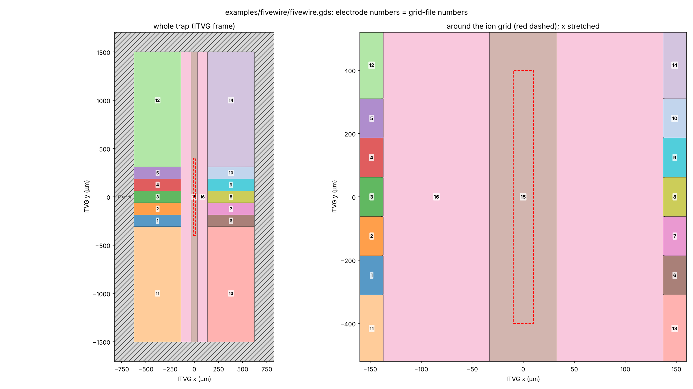

# gds2itvg

Unit-potential grid files for surface-electrode ion traps, computed from a GDSII layout
and written in the format read by ITVG's `VoltageGenerator`.

Each electrode is set to 1 V and everything else to 0 V. The potential is evaluated on a
regular 3-D grid above the trap and written as one file per electrode.



*Bundled example: a five-wire trap with five 120 µm DC fingers per side. Each colour is
an electrode, labelled with its grid-file number. See `examples/fivewire`.*

License: GPL-3.0-or-later. Design and validation are in [GUIDELINES.md](GUIDELINES.md)
and [RESULTS.md](RESULTS.md).

## Models

| Model | What it assumes | Select with |
|---|---|---|
| **Device stack** (default) | Gaps split at their midline, then given the surface potential from a 2-D cross-section of the real stack: metal thickness, gap-filling dielectric, buried ground plane. Outside the chip the surface floats over a ground at a chosen depth. | default (`--gap-model profile`) |
| **Gapless** | The classic gapless-plane model: every gap is split at its midline, and the surface is grounded out to infinity. Fastest. | `--gap-model midline --no-finite-chip` |

Device-stack defaults:

- 1 µm metal;
- SiO₂ dielectric (ε_r = 3.9) filling the gaps;
- a continuous buried ground 10 µm below the surface;
- outside the chip, vacuum with a ground 1 mm down.

All of these are options (see the reference below).

Potentials come from the closed-form solid-angle (Biot–Savart-like) edge sum. See
[`literature/README.md`](literature/README.md).

## Install

```bash
pip install -e .            # numpy >= 2, scipy, gdstk, shapely
pip install -e .[test]      # + numba (≈14× faster kernel) and pytest
pip install -e .[plot]      # + matplotlib, for --label-png
```

## How to generate grid files

The steps use the bundled example. Regenerate it with
`python examples/fivewire/make_fivewire.py`.

### 1. Gather the inputs

| Input | Example (`examples/fivewire`) | Where it goes |
|---|---|---|
| GDSII file | `fivewire.gds` | command-line argument |
| Electrode layer / datatype | 1 / 0 | `layer`, `datatype` |
| A box around the trap, GDS µm | `[-1500, -681, 1500, 681]` | `roi_box` |
| GDS → ITVG frame: origin and rotation | origin (0, 0), +90° (trap axis GDS x → ITVG y) | `frame` |
| Electrode numbers: one seed point inside each electrode | 1–16, ground ring 17 | `electrodes`, `ground` |
| Ion grid, ITVG frame, µm | x ±10, y ±400, z 57–77, step 1 | `--x/--y/--z` |
| Device stack | 1 µm metal, ε_r 3.9, buried ground 10 µm | `metal_thickness`, `epsilon_r`, `ground_depth` |
| Surroundings of the chip | ground 1 mm down outside the chip | `outer_ground_depth`, `chip_outline` |

### 2. Find the conductors

```bash
gds2itvg examples/fivewire/fivewire.gds --layer 1 --list-conductors
```

This prints each conductor's bounding box, area and a seed point inside it. Add
`--roi XMIN YMIN XMAX YMAX` to list only one trap of a larger chip.

### 3. Write a layout file

See `examples/fivewire/fivewire.json`:

```json
{
 "layer": 1, "datatype": 0,
 "roi_box": [-1500, -681, 1500, 681],
 "frame": {"origin": [0.0, 0.0], "quarter_turns": 1, "mirror": false},
 "electrodes": {"1": [[-248.0, 379.5]], "16": [[0.0, 85.0], [0.0, -85.0]]},
 "ground": {"17": [[0.0, 724.0]]}
}
```

- **`frame`:** ITVG coordinates are `R(quarter_turns·90°)·(p_gds − origin)`. The ITVG y
  axis is normally the trap axis.
- **Several seeds per number** merge several conductors into one electrode, like the two
  RF rails of 16 here.
- **Ground electrodes** are 0 V and get no file.
- **Unlisted conductors** inside the box are treated as ground, with a warning.

### 4. Check the numbering

```bash
gds2itvg examples/fivewire/fivewire.gds --layout examples/fivewire/fivewire.json \
    --x=-10:10:1 --y=-400:400:1 --z=57:77:1 --label-png labels.png --label-only
```

This draws every electrode with its grid-file number in the ITVG frame, with the ion grid
outlined. It's the image above.

### 5. Find the ion height (optional)

```bash
gds2itvg examples/fivewire/fivewire.gds --layout examples/fivewire/fivewire.json \
    --x=-10:10:1 --y=-400:400:1 --z=57:77:1 --rf-null 16
```

This reports the RF null (the pseudopotential minimum) of the named RF electrode(s) at the
start, centre and end of `--y`. For the example it is x = 0, z = 67.2 µm. Centre your
`--z` range on it.

### 6. Generate

```bash
gds2itvg examples/fivewire/fivewire.gds --layout examples/fivewire/fivewire.json \
    --x=-10:10:1 --y=-400:400:1 --z=57:77:1 --out gridfiles/FiveWire --stub FiveWire-
```

- Use `--x=-10:10:1` (with `=`) when an axis starts negative.
- The stub must not contain digits.
- `--force` overwrites an existing batch.

Run time for the example (16 electrodes × 353 241 points, 4 cores, from start to finished
files):

| Model | Total |
|---|---|
| Device stack | 12 s |
| Gapless | 8.5 s |

About 5 s of each is writing the text files. A 30-electrode, 10 mm trap on a 706 041-point
grid takes about 75 s with the device stack and 40 s gapless.

### 7. Load in ITVG

```python
from VoltageGenerator import VoltageGenerator
gen = VoltageGenerator("gridfiles/FiveWire")
```

- ITVG caches imports in `savefields.dat`. Delete it, or write with `--force`, after
  regenerating.
- `--write-ground` also writes all-zero files for ground electrodes.

## Python API

```python
from gds2itvg import Layout, GridSpec, build_electrodes, grid_unit_potentials, write_batch

layout = Layout.from_json("examples/fivewire/fivewire.json")
grid = GridSpec(x=(-10, 10, 1), y=(-400, 400, 1), z=(57, 77, 1))
electrodes = build_electrodes("examples/fivewire/fivewire.gds", layout,
                              ion_box=(-10, 10, -400, 400), ion_z=(57, 77))
phi = grid_unit_potentials(electrodes, grid)          # {"1": array, ...}
write_batch("gridfiles/FiveWire", grid, phi, stub="FiveWire-")
```

## Command-line options

| Option | Meaning |
|---|---|
| `--layout` | Layout file: layer, ROI box, frame, electrode numbers, device stack. Without it, use `--layer` and `--roi`, and conductors are numbered 1…N. |
| `--x`, `--y`, `--z` | Ion grid axes, `START:STOP:STEP` in ITVG µm. |
| `--gap-model` | `profile` (device stack, default), `midline` (gapless) or `drawn` (gaps at 0 V). |
| `--ground-depth` | Buried ground depth in µm (default 10), or `none`. |
| `--epsilon-r`, `--metal-thickness` | Device stack (defaults 3.9 and 1 µm). |
| `--outer-ground-depth` | Ground depth outside the chip in µm (default 1000; `inf` = vacuum). |
| `--no-finite-chip` | Grounds the surface outside the chip. |
| `--max-gap` | Gaps up to this width (µm, default 30) are split at their midline. |
| `--simplify-keep`, `--no-simplify` | Geometry farther than this (default 200 µm) from the ion grid is simplified, which is faster and changes potentials by a few µV per V. `--no-simplify` keeps it exact. |
| `--label-png`, `--label-only` | Electrode / grid-file-number map. |
| `--rf-null N…` | Report the RF null of electrode(s) N and exit. |
| `--list-conductors` | List the layer's conductors and exit. |
| `--write-ground`, `--force`, `--stub`, `--backend` | Output details. |

## Layout file reference

| Key | Meaning |
|---|---|
| `layer`, `datatype`, `cell` | Electrode layer. `cell` defaults to the single top cell. |
| `roi_box` | GDS µm box that *selects* the trap's conductors; it never clips them. Conductors within `max_gap` of the selection also take part. |
| `frame` | `origin`, `quarter_turns`, `mirror`: the GDS → ITVG transform. |
| `electrodes`, `ground` | `{number: [[x, y], ...]}` seed points. |
| `fill` | `{number: [polygon, ...]}`: metal added to an electrode before the gaps are split, e.g. to run a rail through a notch. |
| `max_gap` | Largest gap (µm) that is split at its midline. Wider openings fringe over the dielectric (device stack), or are 0 V (gapless). |
| `gap_model`, `metal_thickness`, `epsilon_r`, `ground_depth`, `strips_per_gap` | Gap model and device stack. `ground_depth: null` means no buried ground. |
| `chip_outline`, `outer_ground_depth` | Finite chip. `"auto"` is the bounding box of the trap metal; `null` depth grounds the surface to infinity; `1e400` means vacuum. |
| `simplify_keep`, `simplify_rel_tol`, `strip_interpolation` | Speed settings (see GUIDELINES.md). |

## Output format

- One file per electrode, `<stub><n>.txt`.
- Tab-separated `x  y  z  V` rows, in µm and volts.
- x varies fastest, then y, then z.
- The grid is uniform, and values are written with full float64 precision.

## Tests

```bash
pytest -q
```

CI runs on Python 3.10–3.13. Optional checks run when these are set:

- `GDS2ITVG_REFERENCE`: a nist-ionstorage/electrode checkout, for the kernel cross-check;
- `GDS2ITVG_ITVG`: an ITVG checkout, for the `VoltageGenerator` round-trip;
- `GDS2ITVG_JULIA`: Julia, for the benchmark kernel.

## Acknowledgements

- [nist-ionstorage/electrode](https://github.com/nist-ionstorage/electrode) by Robert
  Jördens (GPL-3.0; DOI 10.5281/zenodo.10118), whose polygon kernel formula this package
  mirrors and is validated against.
- R. Schmied, NJP 12, 023038 (2010), and J. H. Wesenberg, PRA 78, 063410 (2008), for the
  gapped and finite surface-electrode electrostatics. See `literature/README.md`.

Please cite with `CITATION.cff`.
